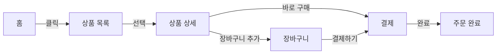

# 🎨 UX 와이어프레임 작성법

> 아이디어를 시각적으로 구조화하여 개발 전 검증하는 효율적인 방법

## 🎯 와이어프레임이란?

와이어프레임은 웹사이트나 앱의 뼈대를 보여주는 시각적 가이드입니다. 색상이나 디자인 없이 레이아웃과 기능에만 집중합니다.

### 와이어프레임의 단계
1. **Lo-Fi (저충실도)**: 손그림, 기본 도형
2. **Mid-Fi (중충실도)**: 디지털 도구, 실제 콘텐츠
3. **Hi-Fi (고충실도)**: 상세 레이아웃, 인터랙션

## 🚀 30분 와이어프레임 작성법

### 1단계: 핵심 화면 식별 (5분)

```yaml
MVP_핵심_화면:
  필수:
    - 랜딩 페이지
    - 로그인/가입
    - 대시보드
    - 핵심 기능 화면
    
  선택:
    - 설정
    - 프로필
    - 도움말
    
  나중에:
    - 관리자 화면
    - 분석 대시보드
    - 고급 설정
```

### 2단계: 빠른 스케치 (10분)

```
┌─────────────────────────────┐
│  Logo    Home  About  Login │ <- 헤더
├─────────────────────────────┤
│                             │
│   [  큰 제목 텍스트  ]      │ <- 히어로 섹션
│   설명 텍스트...            │
│   [ CTA 버튼 ]              │
│                             │
├─────────────────────────────┤
│ ┌───┐  ┌───┐  ┌───┐       │
│ │아이콘│ │아이콘│ │아이콘│    │ <- 기능 소개
│ │   │  │   │  │   │       │
│ └───┘  └───┘  └───┘       │
│ 설명1   설명2   설명3       │
└─────────────────────────────┘
```

### 3단계: 컴포넌트 정의 (10분)

```typescript
// 와이어프레임 컴포넌트 정의
const wireframeComponents = {
  // 네비게이션
  nav: {
    type: "horizontal",
    items: ["Logo", "Menu Items", "User Actions"],
    mobile: "hamburger"
  },
  
  // 콘텐츠 블록
  hero: {
    layout: "center",
    elements: ["Headline", "Subtext", "CTA Button", "Image/Video"]
  },
  
  // 카드 레이아웃
  cards: {
    grid: "3-column",
    content: ["Icon", "Title", "Description", "Link"]
  }
};
```

### 4단계: 반응형 고려 (5분)

```
데스크톱 (1200px+)          태블릿 (768px)           모바일 (375px)
┌───┬───┬───┐              ┌───┬───┐                ┌───┐
│   │   │   │              │   │   │                │   │
├───┼───┼───┤              ├───┴───┤                ├───┤
│   │   │   │     →        │       │       →        │   │
├───┴───┴───┤              ├───┬───┤                ├───┤
│           │              │   │   │                │   │
└───────────┘              └───┴───┘                └───┘
```

## 🤖 AI 와이어프레임 생성

### 텍스트로 와이어프레임 생성
```bash
/wireframe "대시보드" --layout "sidebar" --components "stats,chart,table"

# 생성 결과:
┌─────────────────────────────────┐
│ ┌─────┐ ┌───────────────────┐  │
│ │     │ │   대시보드          │  │
│ │ 사  │ ├───────────────────┤  │
│ │ 이  │ │ ┌───┐ ┌───┐ ┌───┐│  │
│ │ 드  │ │ │통계│ │통계│ │통계││  │
│ │ 바  │ │ └───┘ └───┘ └───┘│  │
│ │     │ ├───────────────────┤  │
│ │     │ │   차트 영역        │  │
│ │     │ ├───────────────────┤  │
│ │     │ │   테이블 영역      │  │
│ └─────┘ └───────────────────┘  │
└─────────────────────────────────┘
```

### 컴포넌트 라이브러리 활용
```typescript
// 재사용 가능한 와이어프레임 컴포넌트
const WireframeKit = {
  // 레이아웃
  layouts: {
    dashboard: "sidebar + main",
    landing: "hero + features + cta",
    form: "header + form + footer"
  },
  
  // UI 패턴
  patterns: {
    card: "□ [img] \n Title \n Description",
    list: "• Item 1 \n • Item 2 \n • Item 3",
    form: "[Label] \n [_____] \n [Submit]"
  }
};
```

## 📐 와이어프레임 도구별 장단점

### 🎨 디자인 도구
| 도구 | 장점 | 단점 | 추천 상황 |
|------|------|------|-----------|
| **Figma** | 실시간 협업, 무료 | 학습곡선 | 팀 프로젝트 |
| **Excalidraw** | 매우 쉬움, 빠름 | 기능 제한 | 빠른 스케치 |
| **Balsamiq** | 와이어프레임 특화 | 유료 | 전문적 사용 |
| **Paper** | 가장 빠름 | 디지털화 필요 | 초기 아이디어 |

### 🤖 AI 도구
```yaml
AI_와이어프레임_도구:
  Uizard:
    특징: "손그림 → 디지털"
    장점: "스케치 인식"
    단점: "정확도 변동"
    
  Galileo:
    특징: "텍스트 → UI"
    장점: "빠른 생성"
    단점: "커스터마이징 제한"
    
  v0.dev:
    특징: "설명 → 코드"
    장점: "바로 구현 가능"
    단점: "React 전용"
```

## 🎯 화면별 와이어프레임 템플릿

### 1. 랜딩 페이지
```
┌─────────────────────────────┐
│ Logo          Menu    [CTA] │
├─────────────────────────────┤
│                             │
│      [메인 헤드라인]         │
│   부제목 설명 텍스트...      │
│                             │
│   [시작하기]  [더 알아보기]  │
│                             │
├─────────────────────────────┤
│  기능1     기능2     기능3  │
│  ┌───┐    ┌───┐    ┌───┐  │
│  │   │    │   │    │   │  │
│  └───┘    └───┘    └───┘  │
├─────────────────────────────┤
│        고객 후기            │
│  ★★★★★  "정말 좋아요"     │
└─────────────────────────────┘
```

### 2. 대시보드
```
┌─────────────────────────────┐
│ Logo  검색 [____]    👤 알림 │
├──────┬──────────────────────┤
│      │  환영합니다, 사용자님 │
│ 홈   ├──────────────────────┤
│      │ ┌────┐ ┌────┐ ┌────┐│
│ 분석 │ │통계1│ │통계2│ │통계3││
│      │ └────┘ └────┘ └────┘│
│ 설정 ├──────────────────────┤
│      │     최근 활동         │
│ 로그 │ • 항목 1             │
│ 아웃 │ • 항목 2             │
│      │ • 항목 3             │
└──────┴──────────────────────┘
```

### 3. 폼 화면
```
┌─────────────────────────────┐
│        회원 가입            │
├─────────────────────────────┤
│                             │
│  이메일                     │
│  [____________________]     │
│                             │
│  비밀번호                   │
│  [____________________]     │
│                             │
│  비밀번호 확인              │
│  [____________________]     │
│                             │
│  □ 이용약관 동의            │
│                             │
│      [가입하기]             │
│                             │
│  이미 계정이 있으신가요?     │
│      로그인하기             │
└─────────────────────────────┘
```

## 💡 인터랙션 표시법

### 기본 인터랙션 심볼
```
클릭/탭:      [버튼] → 다음화면
호버:         [요소]:hover → 상태변경
스와이프:     ← [콘텐츠] → 
드래그:       [A] ↔ [B]
팝업:         [트리거] → ▤ 팝업
토글:         ○ ↔ ●
```

### 플로우 다이어그램


## 🚀 빠른 검증 방법

### 5초 테스트
```yaml
테스트_방법:
  1. 와이어프레임을 5초간 보여줌
  2. 질문:
     - "이 화면의 목적은?"
     - "가장 먼저 눈에 들어온 것은?"
     - "다음에 할 행동은?"
  3. 성공_기준:
     - 80% 이상 정답
     - 주요 CTA 인지
```

### 태스크 시나리오
```typescript
// 사용자 태스크 테스트
const taskScenarios = [
  {
    task: "상품을 구매하세요",
    expectedPath: ["홈", "상품목록", "상품상세", "장바구니", "결제"],
    successRate: 0.9
  },
  {
    task: "프로필을 수정하세요",
    expectedPath: ["메뉴", "설정", "프로필", "수정"],
    successRate: 0.85
  }
];
```

## 📋 와이어프레임 체크리스트

### 완성도 검증
- [ ] 모든 핵심 화면이 포함되었는가?
- [ ] 네비게이션 흐름이 명확한가?
- [ ] 반응형 레이아웃을 고려했는가?
- [ ] 에러 상태를 표시했는가?
- [ ] 로딩 상태를 표시했는가?

### 사용성 검증
- [ ] 중요한 요소가 눈에 띄는가?
- [ ] 클릭/탭 영역이 충분한가?
- [ ] 텍스트가 읽기 쉬운 크기인가?
- [ ] 일관된 레이아웃을 사용하는가?
- [ ] 접근성을 고려했는가?

## 🎨 와이어프레임 → 디자인 전환

### 단계별 진화
```
1. Lo-Fi 와이어프레임 (30분)
   └→ 2. 디자인 토큰 적용 (1시간)
      └→ 3. UI 컴포넌트 (2시간)
         └→ 4. 최종 디자인 (3시간)
```

### 핸드오프 문서
```yaml
디자이너_전달사항:
  와이어프레임: "Figma 링크"
  
  기능_설명:
    - 각 요소의 목적
    - 인터랙션 설명
    - 엣지 케이스
    
  디자인_가이드:
    - 브랜드 컬러
    - 참고 사이트
    - 톤앤매너
    
  우선순위:
    1: "핵심 화면"
    2: "서브 화면"
    3: "관리자 화면"
```

## 다음 단계

와이어프레임이 완성되면 **[디자인 토큰 시스템](03_Design_Token_System.md)**을 통해 일관된 디자인 언어를 정의합니다.