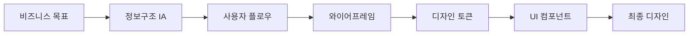

# 🎨 정보구조(IA) · UX · UI 시스템 완벽 가이드

> MVP를 위한 체계적인 디자인 시스템 구축 - 정보구조부터 UI 컴포넌트까지

## 📚 목차

### 🏗️ 기본 구축 (MVP 필수)
1. [정보구조(IA) 설계](01_Information_Architecture.md)
2. [UX 와이어프레임 작성법](02_UX_Wireframing.md)  
3. [디자인 토큰 시스템](03_Design_Token_System.md)
4. [컴포넌트 라이브러리 구축](04_Component_Library.md)

### 🚀 고급 활용 (확장)
5. [AI 디자인 패턴](05_AI_Design_Patterns.md)
6. [크로스 플랫폼 디자인](06_Cross_Platform_Design.md)
7. [디자인 시스템 자동화](07_Design_System_Automation.md)  
8. [디자인 시스템 진화](08_Design_System_Evolution.md)

## 🚀 빠른 시작

### 30분 디자인 시스템

```bash
# AI 기반 디자인 시스템 생성
/design-system "온라인 교육 플랫폼" --style "modern-clean" --colors "blue"

# 자동 생성되는 것들:
# 1. 정보구조 다이어그램
# 2. 핵심 화면 와이어프레임
# 3. 디자인 토큰 (색상, 타이포, 간격)
# 4. 기본 컴포넌트 세트
# 5. Figma 파일 링크
```

## 🎯 핵심 원칙

### 1. MVP 우선 디자인
- **속도 > 완벽함**: 검증이 목적
- **재사용 > 커스텀**: 기존 패턴 활용
- **모바일 > 데스크톱**: 모바일 퍼스트

### 2. 체계적 접근
- **IA → UX → UI**: 순차적 진행
- **토큰 → 컴포넌트**: 상향식 구축
- **문서 → 코드**: 설계 후 구현

## 📊 IA·UX·UI 프로세스



## 💡 AI 활용 팁

### 정보구조 자동 생성
```typescript
// AI가 비즈니스 모델을 분석하여 IA 생성
const ia = await generateIA({
  businessType: "SaaS",
  targetUsers: ["개발자", "디자이너"],
  coreFeatures: ["프로젝트 관리", "협업", "파일 공유"],
  monetization: "구독"
});

// 결과: 계층적 사이트맵 + 네비게이션 구조
```

### 와이어프레임 자동화
```typescript
// 텍스트 설명으로 와이어프레임 생성
const wireframe = await generateWireframe({
  page: "대시보드",
  description: "프로젝트 목록, 최근 활동, 통계 표시",
  layout: "3-column",
  components: ["card", "chart", "list"]
});

// 결과: ASCII 아트 또는 SVG 와이어프레임
```

## 🔧 도구 추천

### 무료 도구
- **Excalidraw**: 빠른 다이어그램
- **Figma (Free)**: 3개 파일까지
- **draw.io**: 플로우차트
- **Whimsical**: 와이어프레임

### AI 도구
- **v0.dev**: UI 컴포넌트 생성
- **Galileo AI**: 디자인 자동화
- **Uizard**: 스케치→디자인
- **Framer AI**: 인터랙션 디자인

## 📐 MVP별 디자인 복잡도

### 🟢 단순 (1-2시간)
- 랜딩 페이지 + 폼
- 5개 이하 화면
- 기본 컴포넌트만 사용

### 🟡 중간 (4-8시간)
- 대시보드 + CRUD
- 10-15개 화면
- 커스텀 컴포넌트 일부

### 🔴 복잡 (2-3일)
- 멀티 페르소나
- 20+ 화면
- 복잡한 인터랙션

## 다음 단계

각 세부 가이드를 통해 체계적으로 디자인 시스템을 구축하세요:

1. **[정보구조 설계](01_Information_Architecture.md)** - 콘텐츠 조직화
2. **[UX 와이어프레임](02_UX_Wireframing.md)** - 화면 설계
3. **[디자인 토큰](03_Design_Token_System.md)** - 디자인 변수 정의
4. **[컴포넌트 라이브러리](04_Component_Library.md)** - UI 블록 구축

## 🔗 관련 가이드

- **[MVP 레시피북](../14_Project_Kickstart/08_MVP_Recipe_Book.md)** - 디자인 시스템을 활용한 실전 MVP 개발 레시피