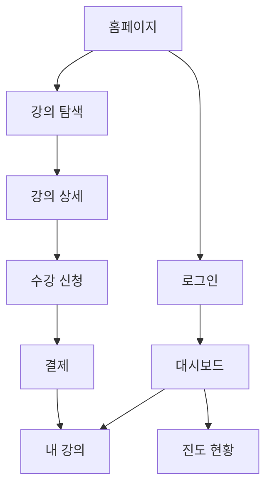

# 📊 정보구조(IA) 설계 가이드

> 사용자가 원하는 정보를 쉽게 찾을 수 있도록 콘텐츠를 체계적으로 조직화하는 방법

## 🎯 IA란 무엇인가?

정보구조(Information Architecture)는 웹사이트나 앱의 콘텐츠를 논리적으로 구성하는 뼈대입니다.

### 핵심 요소
- **계층 구조**: 콘텐츠의 중요도와 관계
- **분류 체계**: 그룹핑과 라벨링
- **네비게이션**: 이동 경로와 방법
- **검색 시스템**: 정보 찾기 방법

## 🚀 MVP를 위한 빠른 IA 설계

### 1단계: 콘텐츠 인벤토리

```yaml
# 교육 플랫폼 예시
콘텐츠_목록:
  공개_영역:
    - 홈페이지
    - 강의 목록
    - 강사 소개
    - 가격 정책
    - 로그인/가입
    
  회원_영역:
    - 대시보드
    - 내 강의
    - 진도 관리
    - 결제 내역
    - 프로필 설정
    
  관리자_영역:
    - 강의 관리
    - 회원 관리
    - 매출 통계
    - 설정
```

### 2단계: 카드 소팅 (AI 활용)

```typescript
// AI를 활용한 자동 카드 소팅
const cardSorting = await aiCardSort({
  contents: ["강의 목록", "내 강의", "진도율", "인증서", "Q&A", "공지사항"],
  userType: "학습자",
  businessGoal: "학습 완료율 향상"
});

// 결과: 최적화된 그룹핑
{
  "학습 센터": ["내 강의", "진도율", "인증서"],
  "커뮤니티": ["Q&A", "공지사항"],
  "탐색": ["강의 목록"]
}
```

### 3단계: 사이트맵 작성

```
🏠 홈
├── 📚 강의
│   ├── 카테고리별
│   ├── 인기 강의
│   └── 신규 강의
├── 👤 내 학습
│   ├── 대시보드
│   ├── 진행 중인 강의
│   └── 완료한 강의
├── 💰 요금제
└── ⚙️ 설정
    ├── 프로필
    ├── 결제 정보
    └── 알림 설정
```

## 🎨 IA 다이어그램 도구

### ASCII 아트 생성기
```bash
/ia-diagram "교육 플랫폼" --style tree --depth 3

# 자동 생성 결과:
Root
├─ Public
│  ├─ Home
│  ├─ Courses
│  │  ├─ Browse
│  │  ├─ Search
│  │  └─ Filter
│  └─ Pricing
└─ Member
   ├─ Dashboard
   ├─ My Courses
   └─ Profile
```

### Mermaid 다이어그램


## 📱 모바일 우선 IA 전략

### 모바일 특화 구조
```yaml
모바일_IA_원칙:
  깊이_제한: "최대 3단계"
  
  하단_네비게이션:
    - 홈
    - 강의
    - 내학습
    - 더보기
    
  제스처_기반:
    - 스와이프: "강의 간 이동"
    - 길게_누르기: "빠른 액션"
    - 당겨서_새로고침: "콘텐츠 업데이트"
    
  우선순위:
    1: "현재 학습 중인 강의"
    2: "새 강의 알림"
    3: "진도 체크"
```

## 🤖 AI 기반 IA 최적화

### 사용자 행동 예측
```typescript
// AI가 사용자 패턴을 분석하여 IA 개선 제안
const iaOptimization = await analyzeUserBehavior({
  clickData: userClicks,
  searchQueries: searchLogs,
  exitPages: bounceData
});

// 개선 제안 예시
{
  "문제점": "사용자의 40%가 결제 페이지를 찾지 못함",
  "해결책": "메인 네비게이션에 '요금제' 추가",
  "예상효과": "전환율 15% 향상"
}
```

### 개인화된 IA
```typescript
// 사용자별 맞춤 네비게이션
function getPersonalizedNav(userProfile) {
  if (userProfile.isNewUser) {
    return ["시작하기", "인기 강의", "무료 체험"];
  } else if (userProfile.isActiveLeaner) {
    return ["내 강의", "이어보기", "새 강의"];
  } else {
    return ["추천 강의", "할인 중", "인기 급상승"];
  }
}
```

## 📊 IA 검증 체크리스트

### 필수 검증 항목
- [ ] **3클릭 규칙**: 모든 페이지 3클릭 내 도달?
- [ ] **명확한 라벨**: 메뉴명이 직관적인가?
- [ ] **일관성**: 네비게이션이 일관된가?
- [ ] **검색 가능**: 중요 콘텐츠가 검색되는가?
- [ ] **모바일 최적화**: 엄지손가락으로 조작 가능?

### A/B 테스트 항목
```yaml
테스트_대상:
  메뉴_구조:
    A: "기능별 그룹핑"
    B: "사용자 목표별 그룹핑"
    
  라벨링:
    A: "내 강의실"
    B: "학습 중"
    
  깊이:
    A: "2단계 메뉴"
    B: "3단계 메뉴"
```

## 💡 MVP별 IA 템플릿

### 1. SaaS 도구 (간단)
```
Home
├── Features
├── Pricing
├── Login/Signup
└── Dashboard (로그인 후)
    ├── Projects
    ├── Settings
    └── Billing
```

### 2. 이커머스 (중간)
```
Home
├── Categories
│   └── Products
│       └── Product Detail
├── Cart
├── Checkout
└── Account
    ├── Orders
    ├── Wishlist
    └── Settings
```

### 3. 소셜 플랫폼 (복잡)
```
Home (Feed)
├── Explore
│   ├── Trending
│   ├── Categories
│   └── Search
├── Create
├── Messages
└── Profile
    ├── Posts
    ├── Followers
    └── Settings
```

## 🚀 실전 팁

### IA 설계 시간 단축법
1. **경쟁사 분석**: 성공한 서비스의 IA 참고
2. **템플릿 활용**: 업종별 표준 IA 사용
3. **AI 도구**: 자동 생성 후 수정
4. **사용자 테스트**: 5명만 테스트해도 80% 문제 발견

### 피해야 할 실수
- ❌ 너무 깊은 계층 구조
- ❌ 애매한 카테고리명
- ❌ 중복되는 경로
- ❌ 숨겨진 중요 기능

## 다음 단계

IA 설계가 완료되면 **[UX 와이어프레임](02_UX_Wireframing.md)**으로 진행하여 각 화면의 레이아웃을 설계합니다.