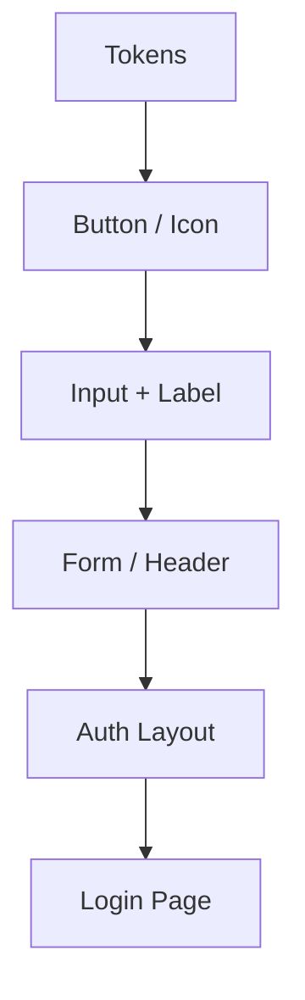

# 디자인 시스템: 개발자를 위한 실전 가이드

> **목표** : 디자인 지식이 없는 개발자(또는 **AI 에이전트**)도 **일관된 UI · UX**를 설계·구현·유지하고, 코드를 자동 생성할 때에도 동일한 규칙을 따르도록 만드는 전 과정을 한 문서로 정리한다. **프로토타입용 스타일가이드 + AI 프롬프트 예시**까지 포함한다.

---

## 1. 핵심 용어 스냅샷

| 용어                    | 한 줄 설명                                     | 당신이 해야 할 일                |
| --------------------- | ------------------------------------------ | ------------------------- |
| **Design System**     | 토큰, 컴포넌트, 패턴, 문서, 워크플로우를 묶은 **운영 체계**      | 코드·문서 버전 관리 + CI 파이프라인 통합 |
| **Style Guide**       | 로고·컬러·타이포 등 **브랜드 룰 북**                    | 린트·테스트로 위반 감지             |
| **Design Tokens**     | 색·간격·폰트 등을 JSON/CSS Vars로 표현한 **설계 최소 단위** | 빌드 단계에서 CSS Vars/TS 타입 변환 |
| **Component Library** | Button·Input·Card 같은 재사용 UI 코드 모음          | Storybook으로 상태·변형 문서화     |
| **Pattern Library**   | 로그인 폼, 리스트 필터 같은 복합 UI 패턴 모음               | 실제 서비스 코드와 링크해 편차 최소화     |

---

## 2. 디자인 토큰 ‑ 팀 / AI 공통 언어

> **토큰 = "설계 값을 코드화"**

### 2.1 토큰 카테고리 & 예시

| 카테고리       | 디자인 예           | JSON 키                     | CSS Var ↔️ JS 사용       |
| ---------- | --------------- | -------------------------- | ---------------------- |
| Color      | Primary #0066FF | `"color.primary.blue.500"` | `var(--c-primary-500)` |
| Typography | H1 = 32/40 Bold | `"type.heading.1"`         | `var(--fs-h1)`         |
| Spacing    | S = 8 px        | `"space.s"`                | `var(--sp-s)`          |
| Radius     | Card = 12 px    | `"radius.card"`            | `var(--r-card)`        |
| Shadow     | Elevation‑1     | `"shadow.1"`               | `var(--sh-1)`          |
| Motion     | Fast‑in 150 ms  | `"motion.fastIn"`          | `var(--mo-fastIn)`     |

```jsonc
// design-tokens.json (발췌)
{
  "color": {
    "primary": { "blue": { "500": "#0066FF" } },
    "neutral": { "50": "#FAFAFA", "900": "#151515" }
  },
  "space": { "xs": 4, "s": 8, "m": 16, "l": 24 },
  "radius": { "card": 12 }
}
```

### 2.2 자동화 파이프라인

1. Figma Tokens → Style Dictionary 변환
2. GitHub PR 머지 시 `npm run build:tokens` → CSS Vars + TypeScript 타입 생성
3. CI 테스트: 중복·미사용 토큰, 네이밍 규칙(lint‑staged) 검증

---

## 3. 타이포그래피 컴포넌트

```tsx
// typography.tsx
export const H1 = ({ children }) => (
  <h1 className="text-[var(--fs-h1)] leading-[var(--lh-h1)] font-bold">
    {children}
  </h1>
);
```

| 레벨   | Size / Line‑Height | 접근성 체크      |
| ---- | ------------------ | ----------- |
| H1   | 32 / 40 px         | 대비 4.5:1 이상 |
| H2   | 24 / 32 px         | 키보드 포커스 가능  |
| Body | 16 / 24 px         | 최소 14 px 유지 |

모듈러 스케일 (`1.25`) + `rem` 단위 → 브랜드 일관 & 사용자 확대 대응.

---

## 4. 컴포넌트 아키텍처 (Atomic Design)



- **Atoms**: 토큰과 1‑1 매핑, 재사용 극대화
- **Molecules**: 단일 책임 원칙(SRP) → 테스트 용이
- **Organisms/Pages**: 도메인 로직 주입, 제품 고유 특성 결정

---

## 5. 프로세스 & 워크플로우

1. **Audit** : 기존 화면 → Figma Auto‑Cluster로 스타일 분류
2. **Define Tokens** : 브랜드 가이드 → JSON 토큰화 → Git push
3. **Build Core Components** : Button, Input, Card → Storybook Docs
4. **Integrate** : 앱 레포에 `@org/design-system` npm 패키지 추가
5. **Governance** : 디자인 변경 PR + 코드 PR 병렬 리뷰, 버전 태깅

---

## 6. 흔한 함정 & 해결법

| 문제            | 증상                 | 해결책                           |
| ------------- | ------------------ | ----------------------------- |
| 토큰 중복         | `--c-primary` 값 3곳 | CI 중복 검사 스크립트 추가              |
| 디자인 ↔️ 개발 불일치 | 픽셀 diff 다수         | Figma Measure, Pixel‑Diff 테스트 |
| 다크 모드 깜박임     | 테마 전환 flash        | `data-theme` 스코프 토큰 선언        |

---

## 7. 추천 도구 & 레퍼런스

- **토큰 관리** : Style Dictionary, Token Transform, Figma Tokens
- **문서화** : Storybook, Ladle, Chromatic(시각 회귀)
- **Lint/테스트** : stylelint, jest‑dom, axe-core(a11y)
- **사례** : Lightning Design System, Shopify Polaris, IBM Carbon, Google Material 3

---

## 8. 빠른 시작 체크리스트 ✅

1.

---

## 9. ⚡ Wireframe Prototype Starter Styleguide

> 저충실도(Low‑Fi) 와이어프레임을 빠르게 제작 + 실제 제품 디자인 시스템으로 확장할 최소 토대.

### 9.1 컬러 팔레트 (Neutral‑First)

| 토큰             | HEX     | 용도       |
| -------------- | ------- | -------- |
| `--c-gray-50`  | #FFFFFF | 배경(화이트)  |
| `--c-gray-100` | #F5F5F5 | 카드 배경    |
| `--c-gray-300` | #E0E0E0 | 테두리·디바이더 |
| `--c-gray-500` | #BDBDBD | 비활성 아이콘  |
| `--c-gray-700` | #757575 | 본문 텍스트   |
| `--c-gray-900` | #212121 | 헤드라인·아이콘 |

### 9.2 타이포그래피 토큰

```jsonc
{
  "type": {
    "title": { "fs": 24, "lh": 32, "fw": 700 },
    "subtitle": { "fs": 20, "lh": 28, "fw": 600 },
    "body": { "fs": 16, "lh": 24, "fw": 400 },
    "caption": { "fs": 14, "lh": 20, "fw": 400 },
    "label": { "fs": 12, "lh": 16, "fw": 500 }
  }
}
```

> Font Stack: `Inter, -apple-system, Roboto, "Helvetica Neue", Arial, sans-serif`

### 9.3 스페이싱 스케일

4 px 계단식 — 4, 8, 12, 16, 24, 32, 48, 64 (`rem` 단위 권장)

### 9.4 컴포넌트 템플릿

| 컴포넌트   | 구조                        | 구현 포인트                                     |
| ------ | ------------------------- | ------------------------------------------ |
| Button | Icon(optional) + Label    | Height 48 px, Radius 4 px, Gray700 text    |
| Card   | Container + Header + Body | Padding 24 px, Shadow none                 |
| Input  | Label + Field             | Border 1 px Gray300, Focus outline Gray700 |
| Icon   | 24 px square placeholder  | Stroke 2 px Gray500                        |

### 9.5 예시 코드 (CSS Vars)

```css
:root {
  /* Gray scale */
  --c-gray-50:#FFF;
  --c-gray-100:#F5F5F5;
  --c-gray-300:#E0E0E0;
  --c-gray-500:#BDBDBD;
  --c-gray-700:#757575;
  --c-gray-900:#212121;

  /* Typography */
  --fs-title:1.5rem; /*24*/
  --lh-title:2rem;   /*32*/
  --fs-body:1rem;    /*16*/
  --lh-body:1.5rem;  /*24*/

  /* Spacing */
  --sp-s:0.5rem; /*8*/
  --sp-m:1rem;   /*16*/
}

.btn {
  display:inline-flex;
  align-items:center;
  gap:0.5rem;
  padding:0 var(--sp-m);
  height:3rem; /*48*/
  background:var(--c-gray-300);
  border-radius:4px;
  font-size:var(--fs-body);
  color:var(--c-gray-900);
}
```

### 9.6 사용 방법

1. Figma: 토큰을 "Local Styles"에 등록 → Auto‑Layout 템플릿 생성
2. Storybook: `npm run storybook` → Wireframe Kit 폴더에 Button, Card, Input 스토리 작성 → 디자이너·PO 승인
3. 실제 제품 디자인 단계에서 **토큰 값만 교체** + 레이아웃 유지

---

## 10. 실전 업그레이드 로드맵

1. Wireframe Kit → 브랜드 토큰 덮어쓰기 (색·폰트 교체)
2. 접근성(a11y) 자동 테스트 통합 (axe-core)
3. 비주얼 회귀(Chromatic)로 UI 중단 점 차트 관리
4. Monorepo(Rush / Nx)로 디자인 시스템·앱 동기 버저닝

---

## 11. 🤖 AI 에이전트(Claude Code CLI) 적용 가이드

### 11.1 구조화된 지식 전달 방식

| 레벨                | 전달 대상                          | 방법                                                                                             | 목적          |
| ----------------- | ------------------------------ | ---------------------------------------------------------------------------------------------- | ----------- |
| **System Prompt** | Claude Code CLI 전체 세션          | "You are a front-end engineer. Always reference \<design\_system.md> for tokens & components." | 전역 룰 강제     |
| **Context File**  | `.cc/context/design_system.md` | 문서 전체를 포함, 대용량 지원                                                                              | 지속적 리콜      |
| **Inline Prompt** | 각 명령 실행 시                      | `<<design_system.md>>` 삽입 + 작업 지시                                                              | 구체적 컴포넌트 생성 |

### 11.2 예시: 버튼 컴포넌트 생성 프롬프트

```md
# Claude Code CLI Prompt
<<docs/design_system.md>>

## Task
Create a React Button component that:
- Uses design token `--c-gray-300` as background by default.
- Accepts `size` prop (`s`\|`m`\|`l`) mapped to spacing tokens.
- Follows accessibility rules WCAG 2.1 AA.
Return the code only.
```

### 11.3 Cascade Prompt (Windsurf 호환)

```cascade
<System>
Follow the attached design system strictly.
</System>
<User files="design_system.md">
Generate a Card component with header, body, and footer slots. Use tokens.
</User>
```

### 11.4 모범 워크플로우

1. `docs/design_system.md` → 레포 루트 커밋
2. `.cc/config.json` 에 "contextFiles": `["docs/design_system.md"]` 등록
3. 새 기능 브랜치에서 `cc` 명령 실행 → 컴포넌트 생성
4. PR 시 GitHub Actions로 **a11y test + Chromatic** 자동 실행

### 11.5 주의사항

- 토큰 값 변경 시 **CLI 컨텍스트 리프레시** 필수 (`cc reload context`)
- 세션 길이 제한 시 **필요 부분만 발췌** (`<<design_system.md#Tokens>>` 섹션 참조 문법 활용)
- 버전 충돌을 막기 위해 **Monorepo 단일 소스**로 관리 (Rush/Nx workspace)

---

## 📚 References

- Google Material Design 3 — [https://m3.material.io](https://m3.material.io)

