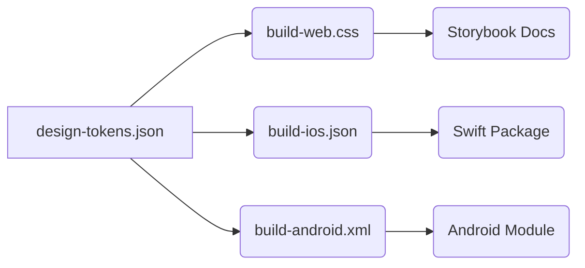

# 🌐🖥️ Web & 📱 Mobile Design Systems: Developer Handbook

> **목적** : 동일한 브랜드 경험을 웹(Responsive)과 모바일(Native iOS·Android)에 전달하기 위해, **플랫폼별 핵심 규칙·토큰 변환·컴포넌트 패턴**을 상세 정리한 문서. AI 코드 에이전트(Claude Code CLI) 컨텍스트 파일로 바로 활용 가능.

---

## 0. 공통 기반

| 영역 | 공통 원칙 |
|------|-----------|
| **Design Tokens** | 단일 `design-tokens.json` 소스 → 빌드 시 **웹용 CSS Vars / 모바일용 JSON(density‑aware)** 자동 변환 |
| **Color Scheme** | 라이트/다크 토큰 세트 일관, WCAG AA 대비 준수 |
| **Brand Voice** | 로고, 아이콘 세트, 일러스트 톤 공유 (SVG → PDF / VectorDrawable 변환) |
| **Versioning** | Monorepo (workspaces) + `@org/design-system-web` `@org/design-system-mobile` 패키지 동시 태깅 |
| **Testing** | Storybook + Chromatic(웹), Jetpack Compose Previews & XCTest Snapshots(모바일) |

---

## 1. 🖥️ Responsive Web Design System

### 1.1 Layout & Grid

| 항목 | 값 | 비고 |
|------|-----|-----|
| **Breakpoints** | `xs` < 480 px, `sm` ≥ 480 px, `md` ≥ 768 px, `lg` ≥ 1024 px, `xl` ≥ 1440 px | `--bp-md:768px` 토큰화 |
| **Grid** | 12 columns, Max width 1440 px | Gutter 24 px, Margin 32 px |
| **Spacing** | 4‑pt scale (4 / 8 / 12 / 16 / 24 / 32 / 48 / 64) | `rem` 기반 |
| **Container** | `.container { max-width: var(--bp-xl); }` | Centered, `%` paddings |

### 1.2 Typography

| 수준 | Size / Line‑Height | Font‑Weight | 예시 CSS Var |
|------|-------------------|-------------|-------------|
| H1 | 32 / 40 px | 700 | `--fs-h1` / `--lh-h1` |
| Body | 16 / 24 px | 400 | `--fs-body` / `--lh-body` |

- Font stack : `Inter, -apple-system, BlinkMacSystemFont, "Segoe UI", Roboto, sans-serif`
- `rem` 단위 사용 → 사용자 브라우저 확대 대응

### 1.3 Interaction & Accessibility

| 항목 | 지침 |
|------|------|
| **Focus States** | `outline: 2px solid var(--c-primary-500);` (브라우저 기본 override) |
| **Hover vs Touch** | 커서 감지(`@media (hover:hover)`) 조건부 스타일 |
| **Prefers‑Reduced‑Motion** | 애니메이션 duration → 0.01s 대체 |
| **ARIA Roles** | Nav, Dialog, Tab 등 필수 롤 지정 |

### 1.4 Components

| 컴포넌트 | 데스크탑 변형 | 모바일 웹 변형 |
|---------|------------|---------------|
| **Navbar** | Logo + Menu + CTA Right | Burger Icon → Drawer |
| **Modal** | Center 640 px | Full screen + Slide‑up |
| **Table** | Scroll X, Sticky Header | Card List + Accordions |

---

## 2. 📱 Native Mobile Design System

### 2.1 Density Units & Token Mapping

| 토큰 유형 | iOS (pt) | Android (dp / sp) | 변환 스크립트 |
|-----------|----------|-------------------|--------------|
| **Spacing** | `space.s = 8pt` | `space.s = 8dp` | `tokens-mobile.js` |
| **Font** | `body.fs = 16pt` | `body.fs = 16sp` | Typography generator |
| **Radius** | `radius.card = 12pt` | `12dp` | — |

> **Script 예시** : `node build/mobile-tokens.js` → `spacing.xml`, `colors.xml`, `dimens.xml`

### 2.2 Navigation Patterns

| 패턴 | iOS | Android | 토큰/컴포넌트 |
|------|-----|---------|--------------|
| **Primary Nav** | Tab Bar | Bottom Navigation | `MobileNavPrimary` |
| **Secondary Nav** | Nav Stack(Push) | Up Navigation(AppBar) | `MobileNavSecondary` |
| **Modal** | Sheet + Grabber | Bottom Sheet / Dialog | `BottomSheet` |

### 2.3 Safe Area & Insets

| 플랫폼 | 고려 요소 | 코드 샘플 |
|--------|----------|---------|
| iOS | Notch, Home Indicator | `geometry.safeAreaInsets` (SwiftUI) |
| Android | Status Bar, Gesture Nav | `WindowInsets` (Compose) |

### 2.4 Typography & Accessibility

| 항목 | iOS | Android |
|------|-----|---------|
| **Base Body** | SF Pro Text 17 pt | Roboto 16 sp |
| **Dynamic Type / FontScale** | `UIFontMetrics` | `TextScaleFactor` |
| **Min Tap Target** | 44×44 pt | 48×48 dp |

### 2.5 Gesture & Feedback

- **iOS** : Edge Swipe Back, Haptic `UIImpactFeedbackGenerator`
- **Android** : Back Button, Ripple Effect(`android:foreground="?attr/selectableItemBackground"`)

---

## 3. Token Generation Pipeline

- **Web** : Style Dictionary → `tokens.css` exposed as CSS Vars
- **iOS** : Script → Swift enum (`DesignTokens.color.primaryBlue500`)
- **Android** : Style Dictionary → `colors.xml`, `dimens.xml`

---

## 4. Implementation Strategy

1. **Monorepo**(`pnpm ws`/Rush/Nx): `packages/design-system-web`, `packages/design-system-mobile`
2. 공유 빌드 스크립트 → `pnpm run build:tokens`
3. **Platform‑specific wrappers**: React (웹), SwiftUI (iOS), Jetpack Compose(Android)
4. VRT (Visual Regression): Chromatic(웹) ↔️ XCTest Snapshots(iOS) ↔️ Paparazzi(Android)

---

## 5. ✅ Platform Checklists

### 5.1 Web
- [ ] Breakpoints & Container 적용
- [ ] Keyboard Focus Style 구현
- [ ] `prefers-reduced-motion` 지원
- [ ] Chromatic build ✅

### 5.2 Mobile
- [ ] Safe Area Insets 처리
- [ ] Dynamic Type / FontScale 대응
- [ ] 48 dp 탭 타깃 보장
- [ ] Dark Mode / Material You 색상 맵핑

---

## 📚 References

- **Google Material Design 3** — <https://m3.material.io>
- **Apple Human Interface Guidelines** — <https://developer.apple.com/design/human-interface-guidelines/>
- **Android Material 3 Design** — <https://m3.material.io>
- **W3C Design Tokens Format** — <https://design-tokens.github.io/community-group/format/>
- **Shopify Polaris** (Responsive Web 사례) — <https://polaris.shopify.com>

